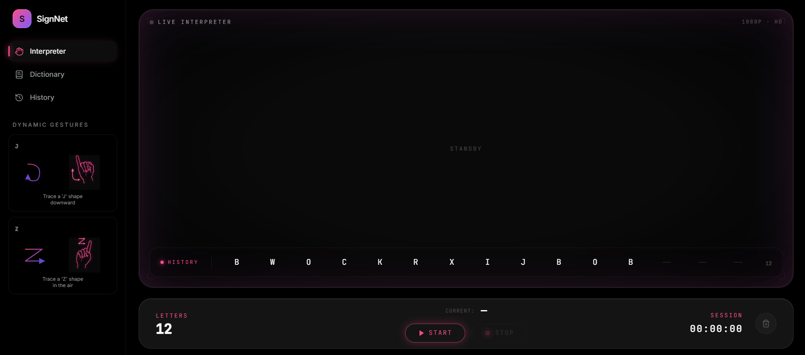
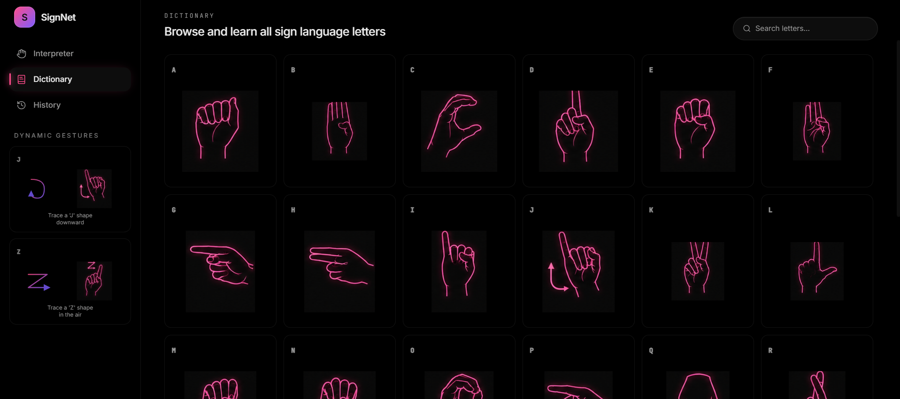
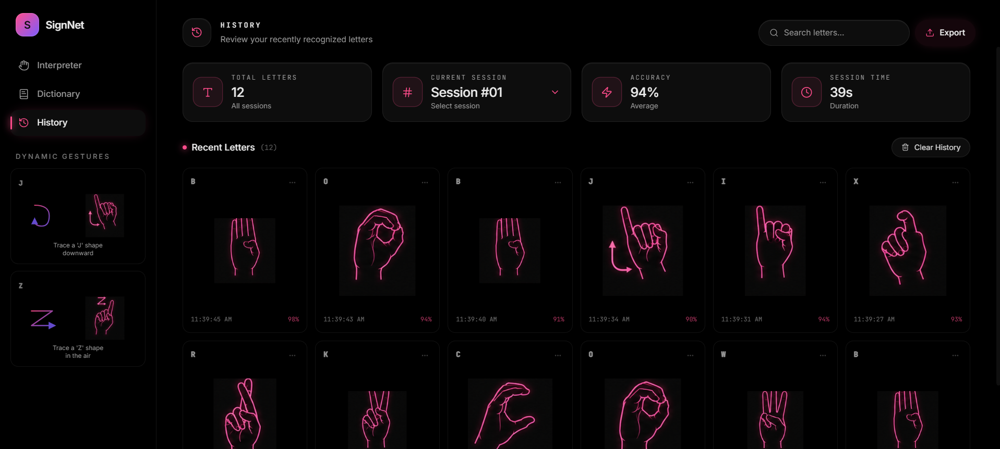
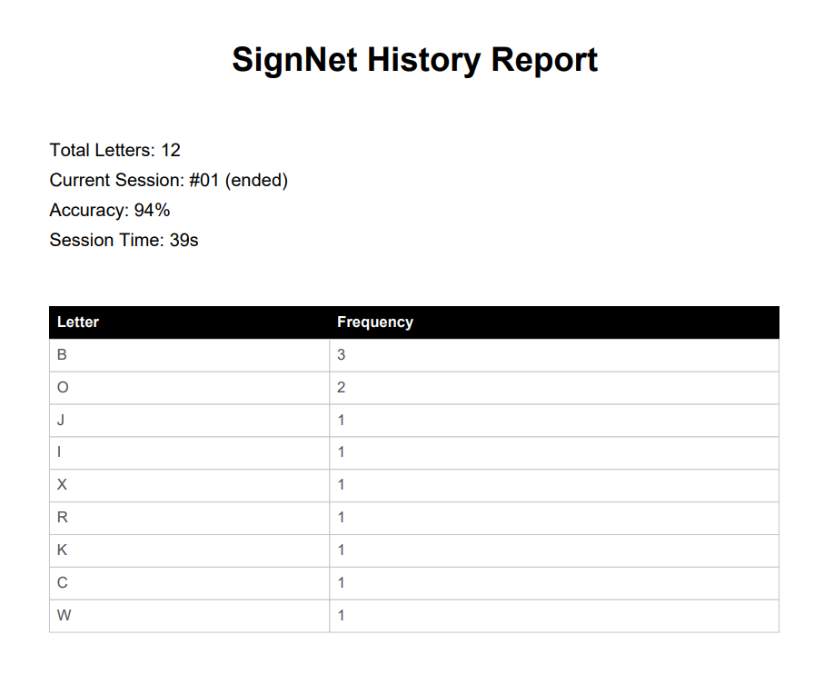

# SignNet

A real-time ASL (American Sign Language) interpretation platform with a futuristic neon interface, live webcam recognition, session tracking, and gesture history analytics.

SignNet combines computer vision, machine learning, and a cinematic cyberpunk-inspired frontend to create an interactive sign language interpretation experience.


# Features

## Real-Time ASL Interpretation

* Live webcam-based sign detection
* Instant alphabet prediction
* Dynamic gesture recognition
* Motion-aware tracking for gestures like:

  * J
  * Z


## Dictionary System

* Full ASL alphabet browser
* Individual neon gesture cards
* Search functionality
* Responsive 6-column layout
* Consistent card-based design language

## Dynamic Session Tracking

* Tracks interpretation sessions based on Start/Stop controls
* Session-specific analytics
* Live session duration tracking
* Accuracy calculations per session

## History System

* Stores recognised letters dynamically
* Displays timestamps for every recognised sign
* Session filtering dropdown
* Export interpretation history to PDF
* Clear history functionality with confirmation modal

## PDF Export

Exports a professional report containing:

* Total letters recognised
* Current session
* Session duration
* Accuracy
* Letter frequency table


# Tech Stack

## Frontend

* React
* TypeScript
* Vite
* Tailwind CSS
* shadcn/ui
* Lucide Icons

## Backend

* FastAPI
* Python
* OpenCV
* MediaPipe
* scikit-learn
* NumPy

## Machine Learning

* Random Forest classifier
* Hand landmark feature extraction
* Dynamic motion sequence classification

---

# Project Structure

```bash
SignNet/
│
├── backend/
│   ├── model/
│   ├── training/
│   ├── features.py
│   ├── predictor.py
│   └── main.py
│
├── frontend/
│   ├── public/
│   ├── src/
│   │   ├── components/
│   │   ├── hooks/
│   │   ├── pages/
│   │   └── api.ts
│   └── package.json
│
└── README.md
```


# Installation

## 1. Clone the repository

```bash
git clone <repository-url>
cd SignNet
```

---

# Backend Setup

## 1. Navigate to backend

```bash
cd backend
```

## 2. Create virtual environment

```bash
python -m venv venv
```

## 3. Activate virtual environment

### Windows

```bash
venv\Scripts\activate
```

### macOS/Linux

```bash
source venv/bin/activate
```

## 4. Install dependencies

```bash
pip install -r requirements.txt
```

## 5. Run backend server

```bash
uvicorn main:app --reload
```

Backend runs on:

```txt
http://127.0.0.1:8000
```

---

# Frontend Setup

## 1. Navigate to frontend

```bash
cd frontend
```

## 2. Install dependencies

```bash
npm install
```

## 3. Run development server

```bash
npm run dev
```

Frontend runs on:

```txt
http://localhost:8080
```


# How It Works

## Static Gesture Recognition

The webcam feed is processed using:

* MediaPipe Hands
* Landmark extraction
* Feature normalisation
* Random Forest prediction

Recognised signs are displayed live in the interpreter.

## Dynamic Gesture Recognition

For gestures involving movement:

* Hand landmark trajectories are tracked
* Motion sequences are classified
* Directional movement patterns are analysed

Currently supported:

* J
* Z


# Session System

A new session starts only when the user presses:

```txt
START
```

A session ends when:

```txt
STOP
```

The History page stores:

* recognised letters
* timestamps
* session duration
* accuracy metrics

---

# Export System

Users can export interpretation history as:

```txt
signnet-history-report.pdf
```

The exported PDF contains:

* summary statistics
* session information
* letter frequency table

---

# UI Design Philosophy

SignNet was designed with a cinematic futuristic interface inspired by:

* sci-fi control systems
* holographic dashboards
* OLED-inspired interfaces
* accessibility-first interaction design

The application prioritises:

* readability
* visual consistency
* real-time responsiveness
* low cognitive clutter

---

# Future Improvements

Potential future additions:

* Word recognition
* Sentence generation
* Speech synthesis
* Multiplayer interpretation sessions
* Gesture training mode
* Cloud sync
* Authentication system
* Mobile support
* Expanded ASL vocabulary


# Acknowledgements

* MediaPipe Hands
* FastAPI
* React
* Tailwind CSS
* scikit-learn
* OpenCV


# Screenshots

Add screenshots of:





